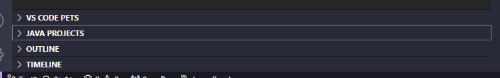

### Updated Setup Guide: Cloning the Repo, Installing JDK, and Adding JSON Library to Your Java Project in VS Code

Follow these steps to set up your Java project with the `json-20240303.jar` file in VS Code, ensuring the `JSONObject` class is recognized and integrated correctly. Additionally, this guide will cover how to install the **Java Development Kit (JDK)** if you haven't done so already.

---

#### Step 1: Install the Java Development Kit (JDK) 

Before starting, ensure that the JDK is installed on your system. The JDK is required for compiling and running Java applications.

1. **Download and Install JDK**:
   - Go to the [Oracle JDK Download Page](https://www.oracle.com/java/technologies/javase-downloads.html) or [OpenJDK](https://openjdk.java.net/install/) for the open-source version.
   - Download the installer appropriate for your operating system (Windows, macOS, or Linux).
   - Follow the installation instructions to install the JDK on your system.

2. **Verify the JDK Installation**:
   - Open your terminal or command prompt.
   - Type the following command to check if JDK is installed and properly set up:
     ```bash
     java -version
     ```
   - You should see the installed JDK version in the output, such as:
     ```
     java version "17.0.1" 2021-10-19 LTS
     ```

3. **Set JAVA_HOME (Optional)**:
   - If needed, set the `JAVA_HOME` environment variable to point to your JDK installation directory. For example:
     - On Windows:
       - Open **System Properties** > **Environment Variables**, and add a new system variable `JAVA_HOME` pointing to your JDK installation path (e.g., `C:\Program Files\Java\jdk-17`).
     - On macOS/Linux:
       - Add the following to your `.bashrc`, `.zshrc`, or `.profile`:
         ```bash
         export JAVA_HOME=/Library/Java/JavaVirtualMachines/jdk-17.jdk/Contents/Home
         export PATH=$JAVA_HOME/bin:$PATH
         ```

---

#### Step 2: Clone the Repository

1. Open your terminal and run the following command to clone the repository:
   ```bash
   git clone https://github.com/Wasif-ZA/BladeRunner.git
   ```

2. Change into the `enggg` directory:
   ```bash
   cd BladeRunner/enggg
   ```

---

#### Step 3: Open VS Code and Install Java Extensions

1. **Open VS Code**.
2. Ensure that you have the **Java Extension Pack** installed:
   - Go to the **Extensions** tab on the left (`Ctrl + Shift + X`).
   - Search for **Java Extension Pack** and install it (if not already installed). This includes support for Java projects, builds, debugging, and more.

---

#### Step 4: Open the Project in VS Code

1. Go to **File > Open Folder**.
2. Navigate to the folder where you cloned the repository (`BladeRunner/enggg`), and select that directory.
3. The project should now open in the VS Code workspace.

---

#### Step 5: Add the JSON JAR to the Classpath in VS Code

1. **Ensure the JAR File is in the Project**:
   - Make sure that `json-20240303.jar` is located in the `lib` folder inside your project directory.

2. **Add the JAR File to the Classpath Using Java Projects Section**:
   - On the left side of VS Code, find the **Java Projects** section. If it’s not visible, use `Ctrl + Shift + P` to open the Command Palette and search for **Java: Open Java Projects View**.
   - Under **Java Projects**, locate your project and click the **+** icon under **Referenced Libraries** to add external JAR files.
   - In the dialog that appears, navigate to your project's `lib` folder and select the `json-20240303.jar` file.

   **Example**:

   

---

#### Step 6: Verify JSON Import in Code

1. Open the `SimpleCCP.java` file (or any Java file in your project) and add the following code to verify that the `org.json.JSONObject` class is recognized:

   ```java
   import org.json.JSONObject;

   public class TestJSON {
       public static void main(String[] args) {
           JSONObject jsonObj = new JSONObject();
           jsonObj.put("name", "Blade Runner");
           jsonObj.put("status", "active");
           System.out.println(jsonObj.toString());
       }
   }
   ```

2. **Run the Program**:
   - Press `F5` to run your program. If everything is set up correctly, you should see the following output in the terminal:
     ```json
     {"name":"Blade Runner","status":"active"}
     ```

---

#### Step 7: Rebuild the Project (Optional)

1. **Rebuild the Project**:
   - If you're facing issues, use the **Java: Clean Java Language Server Workspace** command from the VS Code Command Palette (`Ctrl + Shift + P`) to refresh the Java Language Server and rebuild the workspace.
   
---

#### Additional Tips:

- Ensure that the correct **Java SDK** (Java Development Kit) is configured. You can check this by going to **Settings** (`Ctrl + ,`) and searching for `java.home`.
- If debugging or running the code results in issues, verify that the correct **Java Runtime** is selected in the **Java Projects** section.
  
---

By following these steps, you will successfully clone the repository, add the `json-20240303.jar` file to the classpath, and verify that the `JSONObject` class is properly recognized in your VS Code Java project.
